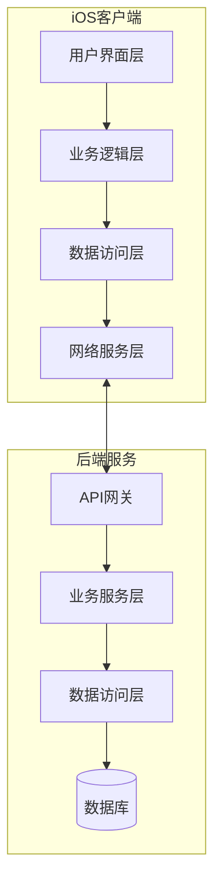

# QuickAccounting 快速记账系统产品文档

## 目录
- [一、产品概述](#一产品概述)
- [二、产品功能介绍](#二产品功能介绍)
- [三、程序概要设计](#三程序概要设计)
- [四、软件架构设计](#四软件架构设计)
- [五、技术亮点及实现原理](#五技术亮点及实现原理)
- [六、部署说明](#六部署说明)

## 一、产品概述

QuickAccounting 是一款现代化的个人记账应用，采用 iOS + Python 技术栈开发，致力于为用户提供简单、高效、可靠的记账解决方案。本系统采用前后端分离架构，具有良好的扩展性和维护性。

### 1.1 设计理念
- **简洁直观**：遵循 iOS 设计规范，提供清晰的用户界面
- **高效便捷**：快速记录日常收支，一键生成统计报表
- **安全可靠**：本地数据库存储，确保数据安全性
- **可扩展性**：模块化设计，支持功能扩展

### 1.2 技术栈
- **前端**：SwiftUI、Combine Framework
- **后端**：Python FastAPI、SQLite
- **架构**：MVVM、RESTful API

## 二、产品功能介绍

### 2.1 核心功能模块

#### 2.1.1 记账管理
- **快速记账**
  - 支持收入/支出记录
  - 自定义金额、分类、描述
  - 自动记录交易时间
  - 支持修改历史记录

#### 2.1.2 分类管理
- **支出类别**
  - 餐饮：日常饮食支出
  - 交通：公共交通、打车等
  - 购物：日用品、衣物等
  - 娱乐：休闲娱乐支出
  - 其他：未分类支出

- **收入类别**
  - 工资：固定工资收入
  - 生活费：家庭生活费
  - 其他收入：临时收入等

#### 2.1.3 统计分析
- **多维度统计**
  - 支持年度统计
  - 支持月度统计
  - 支持日统计
- **数据可视化**
  - **统计卡片展示**
    - 收入卡片：绿色系配色，显示总收入
    - 支出卡片：红色系配色，显示总支出
    - 结余卡片：蓝/红色系配色（根据正负值），显示净额
  - **交易记录列表**
    - 时间倒序排列
    - 支持滚动浏览
    - 包含金额、类型、描述等详细信息
  - **交互式筛选**
    - 年/月/日维度切换
    - 日期选择器
  - **动态效果**
    - 数据加载动画
    - 卡片淡入动画
    - 列表项滑入动画
    - 错误提示动画

#### 2.1.4 系统设置
- **服务器配置**
  - 服务器地址设置（支持自定义 Host）
  - 端口号配置（支持自定义端口）
  - 实时显示当前完整服务器 URL
- **界面交互**
  - 表单式设置界面
  - 键盘类型优化
    - URL 输入优化
    - 数字键盘支持
  - 自动大小写处理
- **设置持久化**
  - 基于 UserDefaults 的设置存储
  - 应用重启后自动恢复配置
  - 实时保存设置更改

### 2.2 用户界面

#### 2.2.1 界面结构
- **底部标签栏**

  - 提供记账页面和静态页面的切换

  

- **记账页面**
  - 提供快速记账功能
  - 用户可以通过简单的表单输入记录收入和支出
  - 支持自定义金额、分类和备注

  

- **统计页面**

  - 展示数据统计信息
  - 用户可以查看不同时间周期的收支情况
  - 通过图表和卡片形式直观展示

  

- **顶部导航栏**

  - **页面标题显示**
  - **右侧功能按钮**
    
    - **统计页面**
      
      - 刷新按钮
      - 设置按钮，便于用户更新数据和调整设置
      
      
    - **记账页面**
      
      - 设置按钮，提供快速访问应用配置的入口
      
      

- **设置界面**

  - 以模态方式呈现
  - 包含服务器配置选项
  - 顶部显示"完成"按钮

  

#### 2.2.2 交互设计
- **记账页面交互**
  
  - 表单输入优化
    - 金额输入自动聚焦
    - 分类快速选择
    
    
    
  - 提交反馈
    - 成功提示动画
    
    
    
    - 错误提示信息
    
    
    
    - 自动清空表单
  
- **统计页面交互**
  
  - 时间筛选
    - 年/月/日切换
    
    
    
    - 日期选择器显示/隐藏
    
    
  - 数据刷新
    - 刷新按钮
    
    
    
    - 加载状态提示
    
    
  - 交易记录操作
    - 长按删除功能
    
    
    
    - 删除后自动刷新
  
- **设置页面交互**
  
  - 输入优化
    - URL 格式验证
    
  - 实时预览
    - 完整服务器地址显示
    
    
    
  - 保存机制
    - 自动保存
    - 即时生效

## 三、程序概要设计

### 3.1 前端模块设计

#### 3.1.1 视图层
主视图采用 TabView 实现底部标签导航，通过 StateObject 管理视图状态：
```swift
struct ContentView: View {
    @StateObject private var viewModel = AccountingViewModel()    // 管理全局状态
    @State private var selectedTab = 0
    
    var body: some View {
        TabView(selection: $selectedTab) {
            NavigationView {
                TransactionFormView(viewModel: viewModel)
            }
            .tabItem {
                Image(systemName: "plus.circle.fill")
                Text("记账")
            }
            .tag(0)
            
            StatisticsView(shouldRefresh: $viewModel.shouldRefreshStatistics)
                .tabItem {
                    Image(systemName: "chart.bar.fill")
                    Text("统计")
                }
                .tag(1)
        }
    }
}
```

主要特点：
1. **状态管理**
   - 使用 `@StateObject` 确保视图模型的生命周期
   - 使用 `@State` 管理标签页选择状态
   - 支持双向绑定的数据刷新机制

2. **导航结构**
   - TabView 实现底部标签导航
   - NavigationView 提供页面导航能力
   - 标签页独立配置和样式

3. **界面组织**
   - 记账表单和统计视图分离
   - 统一的导航风格
   - 清晰的视图层次

4. **交互设计**
   - 标签页切换
   - 导航栈管理
   - 状态同步更新

#### 3.1.2 数据模型
核心数据模型设计，支持 JSON 编解码和唯一标识：
```swift
struct Transaction: Codable, Identifiable {
    let id: String?          // 唯一标识
    let amount: Double       // 交易金额
    let type: String        // 收入/支出
    let category: String    // 交易分类
    let description: String?
    let date: String?
}

struct Statistics: Codable {
    let total_income: Double
    let total_expense: Double
    let net: Double
    let transactions: [Transaction]
}
```

#### 3.1.3 网络层
- API 请求封装
- 错误处理机制
- 数据序列化

### 3.2 后端模块设计

#### 3.2.1 API 接口设计
FastAPI 后端接口实现，支持异步操作：
```python
@app.post("/transaction/")
async def add_transaction(transaction: Transaction):
    # 交易记录添加
    # 支持异步处理

@app.get("/statistics/{period_type}/{period}")
async def get_statistics(period_type: str, period: str):
    # 统计数据查询
    # 支持多维度统计

@app.delete("/transaction/{transaction_id}")
async def delete_transaction(transaction_id: str):
    # 交易记录删除
```

#### 3.2.2 数据库设计
- **表结构**
  - transactions：交易记录表
  - categories：分类管理表
  - settings：系统设置表

#### 3.2.3 业务逻辑层
- 交易管理服务
- 统计分析服务
- 数据验证服务

## 四、软件架构设计

### 4.1 系统架构图



### 4.2 模块依赖关系

#### 4.2.1 前端依赖
- **SwiftUI Framework**
  - 用于构建用户界面
  - `TabView` 实现底部导航
  - `NavigationView` 实现页面导航
  - `Form` 实现设置表单
  - 动画和转场效果

- **Combine Framework**
  - `@Published` 实现数据发布
  - `@StateObject` 管理视图模型
  - 异步数据流处理
  - 网络请求响应处理

- **Foundation**
  - `URLSession` 网络请求
  - `JSONEncoder/Decoder` 数据序列化
  - `UserDefaults` 设置存储
  - 日期和数字格式化

#### 4.2.2 后端依赖
- **FastAPI**
  - RESTful API 实现
  - 请求参数验证
  - 异步路由处理
  - 错误处理中间件

- **SQLite**
  - 本地数据持久化
  - 事务管理
  - SQL 查询优化
  - 数据完整性保证

- **Pydantic**
  - 数据模型定义
  - 请求/响应验证
  - 类型转换
  - 错误信息格式化

## 五、技术亮点及实现原理

### 5.1 MVVM 架构实现
视图模型实现，管理统计数据刷新状态：
```swift
class AccountingViewModel: ObservableObject {
    @Published var shouldRefreshStatistics = false
    
    func refreshStatistics() {
        shouldRefreshStatistics = true
        // 延迟重置状态，确保触发刷新
        DispatchQueue.main.asyncAfter(deadline: .now() + 0.1) {
            self.shouldRefreshStatistics = false
        }
    }
}
```

### 5.2 响应式编程
- 使用 Combine 框架
- 数据双向绑定
- 状态管理机制

### 5.3 异步操作处理
后端异步统计数据处理，包含错误处理机制：
```python
async def get_statistics(period_type: str, period: str):
    try:
        # 异步获取统计数据
        stats = db.get_statistics(period_type, period)
        return stats
    except Exception as e:
        # 统一的错误处理
        raise HTTPException(status_code=400, detail=str(e))
```

### 5.4 数据验证机制
前端错误模型定义，用于处理后端验证错误：
```swift
struct ValidationError: Codable {
    let detail: [ValidationDetail]  // 错误详情列表
}

struct ValidationDetail: Codable {
    let loc: [String]    // 错误位置
    let msg: String      // 错误信息
    let type: String     // 错误类型
}
```

### 5.5 错误处理策略
- 统一的错误处理机制
- 友好的错误提示
- 错误日志记录

### 5.6 数据可视化实现
统计卡片和动画效果实现：
```swift
struct StatCard: View {
    let title: String
    let amount: Double
    let color: Color     // 主题颜色
    let icon: String     // SF Symbol 名称
    
    var body: some View {
        VStack(spacing: 8) {
            HStack {
                Image(systemName: icon)
                    .foregroundColor(color)
                Text(title)
            }
        }
    }
}

// 动画效果
HStack(spacing: 12) {
    StatCard(...)
        .opacity(animateCards ? 1 : 0)     // 淡入效果
        .offset(y: animateCards ? 0 : 20)  // 上移动画
}

// 交易记录列表
ScrollView {
    LazyVStack(spacing: 12) {
        ForEach(stats.transactions.indices, id: \.self) { index in
            TransactionRow(transaction: transaction)
                .animation(.spring(response: 0.5)
                .delay(Double(index) * 0.05), 
                value: animateCards)
        }
    }
}
```

主要特点：
1. **直观的数据展示**
   - 使用卡片式布局突出关键数据
   - 采用颜色编码区分不同类型数据
   - 配合图标增强视觉效果

2. **流畅的交互体验**
   - 支持多维度时间筛选
   - 实时数据更新
   - 平滑的动画过渡

3. **完善的状态反馈**
   - 加载状态动画
   - 错误提示动画
   - 操作结果反馈

4. **性能优化**
   - 使用 LazyVStack 实现列表懒加载
   - 优化动画性能
   - 异步数据加载

## 六、部署说明

### 6.1 系统要求
- iOS 18.0 或更高版本
- 如果需要本地存储服务
  - Python 3.8 或更高版本
  - SQLite 3.x


### 6.2 安装步骤

#### 6.2.1 后端部署（可选）
1. 安装 Python 依赖：
```bash
pip install fastapi uvicorn sqlite3
```

2. 启动服务器：
```bash
uvicorn main:app --host 0.0.0.0 --port 8000
```

#### 6.2.2 iOS 应用安装
- 目前尚未上架 AppStore，故只能通过 Xcode 安装

### 6.3 配置说明
- 服务器地址配置
  - 若是本地部署数据库，地址用 localhost 即可，端口为 `8000`
  - 若需要用到云数据库，地址可填 `47.93.96.145` ，端口为 `8000`
- 数据库连接配置
  - 如需自建数据库服务，请参阅 [6.2.1 后端部署（可选）](#621-后端部署可选)
